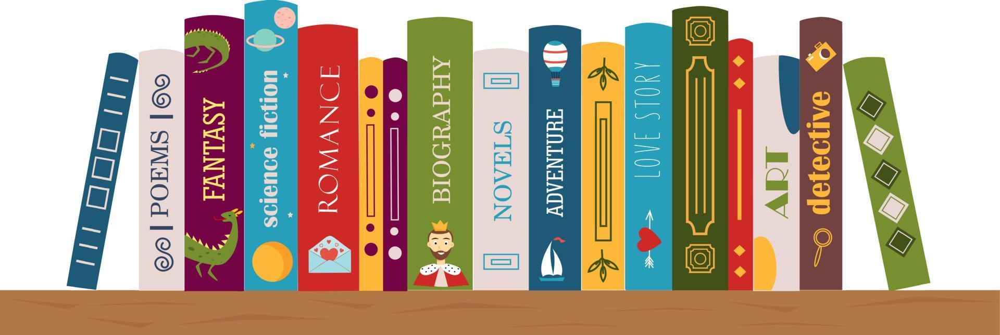

# Book Recommendation System - Unsupervised ML

Image Courtesy: https://www.vecteezy.com/members/alenadumanchuk535799

Check the actual deployment of the model on a live server below.
- [Deployment](https://bookrec.pythonanywhere.com/)

Click on the following link to checkout the video presentation and the colab file.
- [Colab](https://github.com/novus-afk/BookRecommender/blob/master/Book_Recommendation_System.ipynb)
- [Video](https://youtu.be/V51mithhv6A)

---

## Deployment Demo

---

## Problem Statement

During the last few decades, with the rise of Youtube, Amazon, Netflix, and many other such web services, recommender systems have taken more and more place in our lives. From e-commerce (suggest to buyers articles that could interest them) to online advertisement (suggest to users the right contents, matching their preferences), recommender systems are today unavoidable in our daily online journeys.

In a very general way, recommender systems are algorithms aimed at suggesting relevant items to users (items being movies to watch, text to read, products to buy, or anything else depending on industries). Recommender systems are really critical in some industries as they can generate a huge amount of income when they are efficient or also be a way to stand out significantly from competitors. The main objective is to create a book recommendation system for users.

---

## Project Summary

This project aimed to create a book recommendation system using unsupervised learning techniques. The project involved exploring and analyzing the data, visualizing relationships between variables, and experimenting with different charts to gain insights. The data was pre-processed and cleaned to handle missing values and outliers. Several recommender systems were built, including popularity-based filtering, correlation-based recommendations, collaborative filtering using cosine similarity and k-nearest neighbors. The project demonstrated the potential of these techniques to generate personalized book recommendations for users.

The book crossing dataset comprises of 3 files: Books, Users, and Ratings. The books csv contains 271360 rows and 8 columns. The users csv contains 278858 rows and 3 columns. The ratings csv contains 1149780 rows and 3 columns. There are almost 40% missing values in the age column of the user csv.

The main objective of the project was to create a book recommendation system for users. Recommender systems are algorithms aimed at suggesting relevant items to users. They are critical in some industries as they can generate a huge amount of income when they are efficient or also be a way to stand out significantly from competitors.

The project involved data wrangling, including renaming columns, changing datatypes, creating new columns from existing ones, and replacing errors in the data. Data visualization was used to understand the relationships between variables and gain insights from the data.

Several recommender systems were built, including popularity-based filtering, which ranks books based on their average rating and the number of ratings they have received; recommendations based on correlation, which generates recommendations for a specific book among books that have been rated a sufficient number of times; collaborative filtering using cosine similarity (User-User), which calculates the average rating for each book among the k most similar users to the input user; and collaborative filtering using k-nearest neighbors [kNN], which finds the k nearest neighbors of the input book and returns their ISBNs along with their distance to the input book.

---

## Conclusion

In conclusion, this project aimed to create a book recommendation system using unsupervised learning techniques.

Recommender systems are algorithms aimed at suggesting relevant items to users. They are critical in some industries as they can generate a huge amount of income when they are efficient or also be a way to stand out significantly from competitors.

The project involved exploring and analyzing the data, visualizing relationships between variables, and experimenting with different charts to gain insights. The data was pre-processed and cleaned to handle missing values and outliers. Several recommender systems were built, including popularity-based filtering, correlation-based recommendations, collaborative filtering using cosine similarity and k-nearest neighbors.

Important insights from EDA include:

- There are almost 40% missing values in the age column of the user csv.
- Outliers present in Age.
- A lot of zeros in the ratings that are implicit ratings.
- Median implicit rating is 8.
- There are twice as many books published in 2002 than in 1989.
- The most rated book is Wild Animus with 2502 ratings.
- The top author is Agatha Christie for most number of books and for most number of ratings is Nora Roberts.
- Top publisher is Harleyquin.
- Top countries are USA and Canada.

The different recommender systems built include:

- Popularity-based filtering
- Recommendations based on correlation
- Collaborative filtering using cosine similarity (User-User)
- Collaborative filtering using k-nearest neighbors [kNN]
- The project demonstrated the potential of these techniques to generate personalized book recommendations for users.

---

## Author

- [Mohammed Yahya Ansari](https://www.linkedin.com/in/yahya-ansari/)
